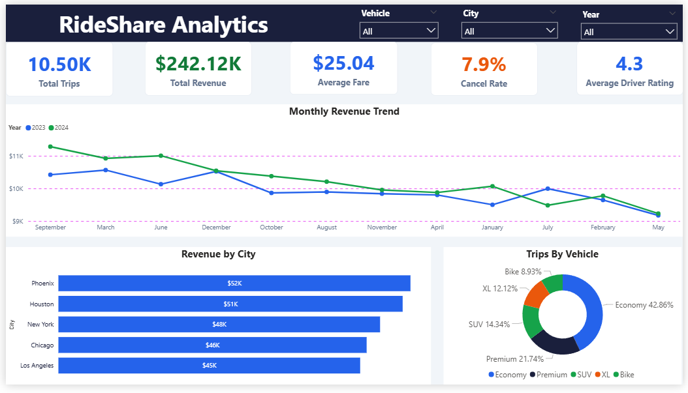
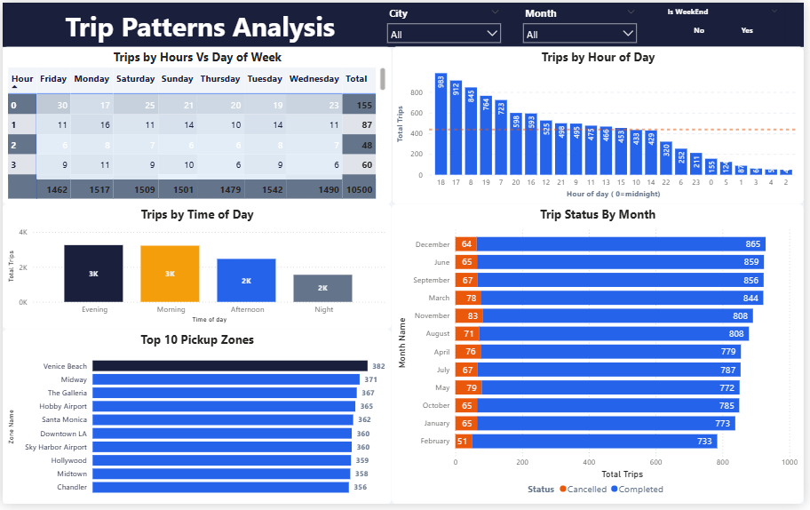
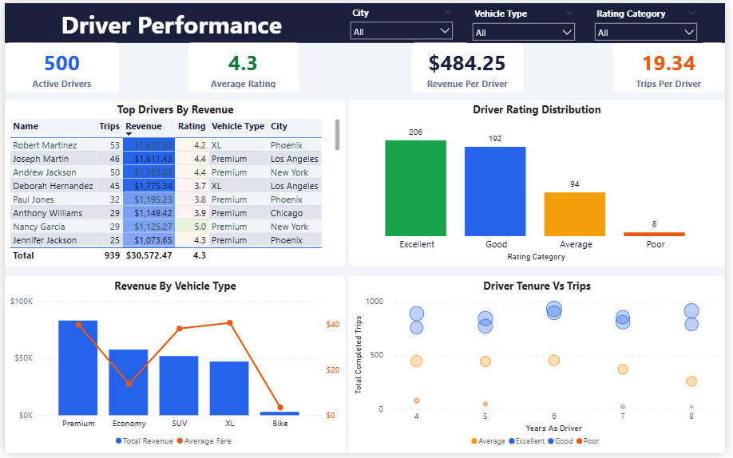
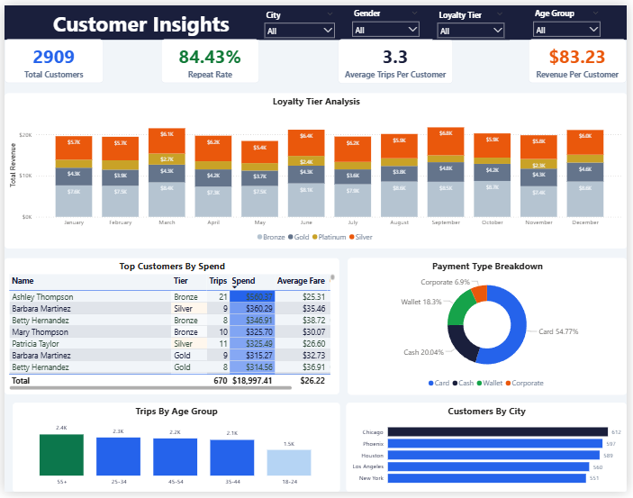

# Ride Sharing Analytics Dashboard — Power BI

A complete end-to-end Power BI project analyzing **10,500 ride sharing trips** across **5 US cities** (New York, Los Angeles, Chicago, Houston, Phoenix) covering **2023–2024**.

Built to demonstrate the full data analyst workflow: raw CSV data → Power Query cleaning → Star Schema modeling → DAX measures → interactive 4-page dashboard.

---

## Table of Contents

1. [Project Overview](#1-project-overview)
2. [Dataset](#2-dataset)
3. [Project Workflow](#3-project-workflow)
4. [Stage 1 — Power Query](#4-stage-1--power-query)
5. [Stage 2 — Data Modeling](#5-stage-2--data-modeling)
6. [Stage 3 — DAX Measures](#6-stage-3--dax-measures)
7. [Dashboard Pages](#7-dashboard-pages)
8. [Screenshots](#8-screenshots)
9. [Repository Structure](#9-repository-structure)
10. [How to Use](#10-how-to-use)
11. [Tools Used](#11-tools-used)
12. [Key Insights](#12-key-insights)
13. [Conclusion](#13-conclusion)

---

## 1. Project Overview

This project simulates a real-world business intelligence scenario for a ride sharing company similar to Uber or Lyft. The goal is to help business stakeholders answer critical questions about revenue performance, driver productivity, customer behavior, and operational patterns — all through a single interactive Power BI dashboard.

**Business questions answered:**

| Category | Question |
|----------|----------|
| Revenue | Which city generates the most revenue? Is revenue growing year over year? |
| Operations | What are the peak hours? Which zones have the most pickups? |
| Drivers | Who are the top earning drivers? Do experienced drivers earn more? |
| Customers | What percentage of customers return? Which loyalty tier spends the most? |

---

## 2. Dataset

Four CSV files form the foundation of this project. Together they represent a normalized relational database structure.

| File | Rows | Type | Description |
|------|------|------|-------------|
| `trips.csv` | 10,500 | Fact table | All ride transactions including fare, distance, duration, surge, status |
| `drivers.csv` | 500 | Dimension | Driver profiles — name, city, vehicle type, rating, join date |
| `customers.csv` | 3,000 | Dimension | Customer profiles — name, city, loyalty tier, age, join date |
| `locations.csv` | 31 | Dimension | Zone names and regions across all 5 cities |

**Coverage:** Jan 2023 – Dec 2024 | 5 US cities | 500 drivers | 3,000 customers

**Vehicle types:** Economy, Premium, SUV, XL, Bike

**Payment types:** Card, Cash, Wallet, Corporate

> Dataset is synthetically generated using Python for learning purposes.

---

## 3. Project Workflow

The project follows the standard Power BI development workflow across 3 stages:

```
Raw CSV Files
     │
     ▼
┌─────────────────────┐
│  Stage 1            │
│  Power Query        │  ← Clean, shape, transform all 4 tables
│  (M Language)       │
└─────────┬───────────┘
          │
          ▼
┌─────────────────────┐
│  Stage 2            │
│  Data Modeling      │  ← Build star schema, create relationships
│  (Model View)       │
└─────────┬───────────┘
          │
          ▼
┌─────────────────────┐
│  Stage 3            │
│  DAX Measures       │  ← Write 25+ business metrics and KPIs
│  (Formula Language) │
└─────────┬───────────┘
          │
          ▼
┌─────────────────────┐
│  4-Page Dashboard   │  ← Interactive reports with slicers and design theme
└─────────────────────┘
```

---

## 4. Stage 1 — Power Query

Power Query is used to clean and shape all 4 raw CSV files before any modeling or visualization begins.

### trips table
| Task | What was done |
|------|---------------|
| Data types | Set fare, distance, duration as Decimal; datetime columns as Date/Time; IDs as Text |
| Null handling | Replaced null tip amounts with 0 |
| Extract date | Added `Pickup Date` column (date only) extracted from `Pickup DateTime` to link with Date Table |
| Total amount | Added custom column `Total Amount = Fare Amount + Tip Amount` |
| Fare category | Added conditional column: Short Ride (<$10), Medium Ride ($10–$30), Long Ride (>$30) |
| Bad rows | Filtered out rows where Duration Minutes = 0 |

### drivers table
| Task | What was done |
|------|---------------|
| Data types | Set join date as Date, rating as Decimal |
| Years Active | Added custom column = current year minus join year |
| Rating Category | Added conditional column: Excellent (≥4.5), Good (≥4.0), Average (≥3.5), Poor (<3.5) |

### customers table
| Task | What was done |
|------|---------------|
| Data types | Set join date as Date, age as Whole Number |
| Age Group | Added conditional column: 18-24, 25-34, 35-44, 45-54, 55+ |

### Date Table (created from scratch)
Built using M code in a Blank Query — covers Jan 2023 to Dec 2024 with columns for Year, Month Number, Month Name, Quarter, Weekday, Is Weekend, Week Number.

---

## 5. Stage 2 — Data Modeling

A **Star Schema** was built in Power BI Model view with `trips` as the central fact table and 4 surrounding dimension tables.

```
              [Date Table]
                   │
                   │ Many-to-One
                   │
[Drivers] ──── [trips] ──── [Customers]
                   │
                   │
              [Locations]
```

### Relationships created

| From table | From column | To table | To column | Cardinality |
|-----------|-------------|----------|-----------|-------------|
| trips | driver_id | drivers | driver_id | Many-to-One |
| trips | customer_id | customers | customer_id | Many-to-One |
| trips | pickup_location_id | locations | location_id | Many-to-One |
| trips | Pickup Date | Date Table | Date | Many-to-One |

### Additional steps
- Marked Date Table as the official date table for time intelligence
- Hidden all foreign key columns from report view
- Created an empty `_Measures` table to store all DAX measures

---

## 6. Stage 3 — DAX Measures

Over 25 DAX measures were written across 6 categories. All measures are stored in the `_Measures` table.

### KPI measures
```dax
Total Trips = COUNTROWS(trips)
Completed Trips = CALCULATE(COUNTROWS(trips), trips[status] = "Completed")
Cancelled Trips = CALCULATE(COUNTROWS(trips), trips[status] = "Cancelled")
Cancellation Rate = DIVIDE([Cancelled Trips], [Total Trips], 0)
Total Revenue = CALCULATE(SUM(trips[Fare Amount]), trips[status] = "Completed")
Avg Fare per Trip = DIVIDE([Total Revenue], [Completed Trips], 0)
```

### Driver measures
```dax
Active Drivers = DISTINCTCOUNT(trips[driver_id])
Avg Driver Rating = AVERAGE(drivers[rating])
Revenue per Driver = DIVIDE([Total Revenue], [Active Drivers], 0)
Trips per Driver = DIVIDE([Completed Trips], [Active Drivers], 0)
```

### Customer measures
```dax
Total Customers = DISTINCTCOUNT(trips[customer_id])
Repeat Customers =
    COUNTROWS(
        FILTER(VALUES(trips[customer_id]),
        CALCULATE(COUNTROWS(trips)) > 1))
Repeat Customer Rate = DIVIDE([Repeat Customers], [Total Customers], 0)
Revenue per Customer = DIVIDE([Total Revenue], [Total Customers], 0)
```

### Time intelligence measures
```dax
Revenue MTD = TOTALMTD([Total Revenue], 'Date Table'[Date])
Revenue YTD = TOTALYTD([Total Revenue], 'Date Table'[Date])
Revenue Last Month = CALCULATE([Total Revenue], PREVIOUSMONTH('Date Table'[Date]))
MoM Growth % = DIVIDE([Total Revenue] - [Revenue Last Month], [Revenue Last Month], 0)
Revenue Same Period Last Year = CALCULATE([Total Revenue], SAMEPERIODLASTYEAR('Date Table'[Date]))
YoY Growth % = DIVIDE([Total Revenue] - [Revenue Same Period Last Year], [Revenue Same Period Last Year], 0)
```

### Peak hour measures
```dax
Peak Hour Trips =
    CALCULATE([Completed Trips],
        trips[Hour of Day] >= 7 && trips[Hour of Day] <= 9
        || trips[Hour of Day] >= 17 && trips[Hour of Day] <= 19)
Weekend Revenue = CALCULATE([Total Revenue], trips[Is Weekend] = "Yes")
Weekday Revenue = CALCULATE([Total Revenue], trips[Is Weekend] = "No")
```

---

## 7. Dashboard Pages

### Page 1 — Executive Summary
Designed for senior management to get a one-glance view of overall business health.

| Visual | Type | Fields used |
|--------|------|-------------|
| Total Trips | KPI Card | COUNTROWS(trips) → **10.50K** |
| Total Revenue | KPI Card | SUM(fare_amount) completed → **$242.12K** |
| Average Fare | KPI Card | DIVIDE(Revenue, Trips) → **$25.04** |
| Cancel Rate | KPI Card | Cancelled / Total trips → **7.9%** |
| Average Driver Rating | KPI Card | AVERAGE(drivers[rating]) → **4.3** |
| Monthly Revenue Trend | Line Chart | Date Table[Month Name], Total Revenue, Year (2023=blue, 2024=green) |
| Revenue by City | Horizontal Bar Chart | trips[city], Total Revenue — Phoenix leads at $52K |
| Trips by Vehicle | Donut Chart | trips[vehicle_type], Total Trips — Economy leads at 42.86% |

**Slicers:** Vehicle, City, Year

### Page 2 — Trip Patterns Analysis
Deep dive into when and where trips happen across hours, days and zones.

| Visual | Type | Fields used |
|--------|------|-------------|
| Trips by Hour vs Day of Week | Matrix Heatmap | trips[hour_of_day] rows, trips[day_of_week] cols, Total Trips |
| Trips by Hour of Day | Column Chart | trips[hour_of_day] (0–23), Total Trips — peaks at hour 17,18 (~983, 912) |
| Trips by Time of Day | Column Chart | trips[time_of_day], Total Trips — Evening=3K, Morning=3K, Afternoon=2K, Night=2K |
| Trip Status by Month | Stacked Bar | Date Table[Month Name], Total Trips, trips[status] legend |
| Top 10 Pickup Zones | Horizontal Bar | locations[Zone Name], Total Trips — Venice Beach leads at 382 |

**Slicers:** City, Month, Is Weekend (Yes/No toggle)

### Page 3 — Driver Performance
Track driver metrics, productivity and ratings.

| Visual | Type | Fields used |
|--------|------|-------------|
| Active Drivers | KPI Card | DISTINCTCOUNT(driver_id) → **500** |
| Average Rating | KPI Card | AVERAGE(drivers[rating]) → **4.3** |
| Revenue per Driver | KPI Card | DIVIDE(Revenue, Active Drivers) → **$484.25** |
| Trips per Driver | KPI Card | DIVIDE(Trips, Active Drivers) → **19.34** |
| Top Drivers by Revenue | Table | drivers[name], Total Trips, Total Revenue, Rating, Vehicle Type, City |
| Driver Rating Distribution | Column Chart | drivers[Rating Category] — Excellent=206, Good=192, Average=94, Poor=8 |
| Revenue by Vehicle Type | Dual Axis Chart | vehicle_type, Total Revenue (bars), Avg Fare (orange line) |
| Driver Tenure vs Trips | Scatter Plot | drivers[Years Active] X, Total Trips Y — colored by Rating Category |

**Slicers:** City, Vehicle Type, Rating Category

### Page 4 — Customer Insights
Understand customer behavior, loyalty and spending patterns.

| Visual | Type | Fields used |
|--------|------|-------------|
| Total Customers | KPI Card | DISTINCTCOUNT(customer_id) → **2,909** |
| Repeat Rate | KPI Card | Repeat Customers / Total Customers → **84.43%** |
| Avg Trips per Customer | KPI Card | DIVIDE(Trips, Customers) → **3.3** |
| Revenue per Customer | KPI Card | DIVIDE(Revenue, Customers) → **$83.23** |
| Loyalty Tier Analysis | Stacked Bar | Date Table[Month Name], Total Revenue, customers[loyalty_tier] — Bronze, Gold, Platinum, Silver |
| Top Customers by Spend | Table | customers[name], Tier, Total Trips, Spend, Avg Fare |
| Payment Type Breakdown | Donut Chart | trips[payment_type] — Card 54.77%, Cash 20.04%, Wallet 18.3%, Corporate 6.9% |
| Trips by Age Group | Column Chart | customers[Age Group] — 55+ leads at 2.4K, 18-24 lowest at 1.5K |
| Customers by City | Horizontal Bar | customers[city] — Chicago leads at 612, New York lowest at 551 |

**Slicers:** City, Gender, Loyalty Tier, Age Group

---

## 8. Screenshots

### Page 1 — Executive Summary


### Page 2 — Trip Patterns Analysis


### Page 3 — Driver Performance


### Page 4 — Customer Insights


---

## 9. Repository Structure

```
rideshare-powerbi-dashboard/
├── data/
│   ├── trips.csv
│   ├── drivers.csv
│   ├── customers.csv
│   └── locations.csv
├── screenshots/
│   ├── excutive_summary.png
│   ├── trip_pattern_analysis.png
│   ├── driver_performance.png
│   └── customer_insights.png
├── RideShare_Dashboard.pbix
└── README.md
```

---

## 10. How to Use

1. Clone or download this repository
2. Open `RideShare_Dashboard.pbix` in **Power BI Desktop**
3. If prompted about data source path, click **Transform Data → Data Source Settings** → update the file paths to point to the `data/` folder on your machine
4. Click **Refresh** to reload all data
5. Use the slicers on each page to filter by city, vehicle type, date range, loyalty tier, and more

---

## 11. Tools Used

| Tool | Purpose |
|------|---------|
| Power BI Desktop | Report building, modeling, DAX |
| Power Query (M language) | Data cleaning and transformation |
| DAX | Calculated measures and KPIs |
| Python | Synthetic dataset generation |
| GitHub | Version control and project sharing |

---

## 12. Key Insights

### Executive Summary (Page 1)
- Total of **10,500 trips** were recorded across 2023–2024 generating **$242,120** in total revenue
- Average fare per trip stands at **$25.04** with a cancellation rate of **7.9%**
- Average driver rating across all cities is **4.3 out of 5.0**
- **Phoenix leads all cities in revenue at $52K**, followed closely by Houston at $51K — New York and Los Angeles are at the lower end despite being larger markets
- **Economy vehicles dominate at 42.86%** of all trips, followed by Premium at 21.74% and SUV at 14.34%
- Revenue shows a **declining trend from 2023 to 2024** — 2024 (green line) consistently falls below 2023 (blue line) across most months, indicating a possible drop in trip demand or average fares

### Trip Patterns (Page 2)
- **Evening (3K) and Morning (3K) are the busiest time-of-day buckets**, with Afternoon and Night both at 2K trips each
- The busiest individual hours are **17 (5pm) at 983 trips and 18 (6pm) at 912 trips** — confirming evening rush hour as peak demand
- Hour 2 is the quietest at just **48 trips**, showing very low late-night demand
- **Venice Beach is the #1 pickup zone at 382 trips**, followed by Midway (371) and The Galleria (367)
- **December has the highest completed trips at 865**, while February has the lowest at 733
- Cancellations remain relatively low and consistent — highest in November (83) and lowest in February (51)
- The heatmap shows trips are spread fairly evenly across all 7 days with slight peaks on weekdays during commute hours

### Driver Performance (Page 3)
- All **500 drivers are active** with an average of **19.34 trips per driver** and average revenue per driver of **$484.25**
- **Robert Martinez is the top earning driver** with 53 trips and $1,829.93 revenue driving an XL in Phoenix
- **Premium vehicles generate the highest total revenue** among all vehicle types, followed by Economy and SUV
- **Bikes generate almost zero revenue** — the bar is nearly flat, confirming Bike rides have very low fare values
- The Avg Fare line (orange) peaks for **Premium at ~$40** and drops to near $0 for Bike, confirming Premium has the highest fare per trip
- Driver rating distribution: **Excellent = 206 drivers (41%), Good = 192 (38%), Average = 94 (19%), Poor = 8 (2%)** — the majority of drivers are rated Excellent or Good
- The scatter plot shows drivers with **4–7 years of experience** cluster around 750–900 total trips, with no clear linear trend suggesting experience alone does not determine productivity

### Customer Insights (Page 4)
- **2,909 unique customers** used the service with an impressive **84.43% repeat rate** — over 8 in 10 customers came back for more than one trip
- Average trips per customer is **3.3** with average revenue per customer at **$83.23**
- **Ashley Thompson is the top customer by spend** with 21 trips and a Bronze tier — showing high-spending customers are not always in the top loyalty tier
- **Chicago has the most customers at 612**, followed by Phoenix (597) and Houston (589) — New York has the fewest at 551
- **55+ age group makes the most trips at 2.4K**, and the 18-24 group makes the fewest at 1.5K — older customers are the most frequent riders
- **Card is the most used payment method at 54.77%**, followed by Cash at 20.04%, Wallet at 18.3%, and Corporate at 6.9%
- The Loyalty Tier stacked bars show **Silver and Bronze tiers contribute the largest share of monthly revenue** consistently throughout the year, with Platinum contributing the smallest slice

---

## 13. Conclusion

This project demonstrates a complete Power BI analytics pipeline applied to a real-world business scenario. Starting from raw CSV files and ending with a polished 4-page interactive dashboard, every stage of the data analyst workflow was covered.

**What this project proves:**

| Skill area | What was demonstrated |
|------------|----------------------|
| Data cleaning | Handled type mismatches, nulls, bad rows and datetime extraction in Power Query |
| Data architecture | Designed a proper star schema with correct relationships and cardinality |
| Business logic | Translated business questions into accurate DAX measures including time intelligence |
| Storytelling | Organized findings across 4 focused pages each answering a specific business question |
| Design | Applied a consistent navy and blue theme with conditional formatting across all pages |

**What a business could act on from this dashboard:**

- The **declining revenue trend from 2023 to 2024** on Page 1 is an immediate red flag that management should investigate — whether caused by fewer trips, lower fares, or increased cancellations
- Page 2 shows **off-peak hours (midnight to 6am) have very low demand** — the business could offer driver incentives during those hours to improve availability when surge pricing could be higher
- Page 3 shows **Bike rides generate almost no revenue** — the business could consider reducing the Bike fleet or retiring the category entirely
- Page 4 reveals the **55+ age group is the most frequent rider segment** — a dedicated loyalty campaign for this group could significantly increase revenue
- The **84.43% repeat rate** on Page 4 is a strong retention signal — the business should focus on converting the remaining 15.57% one-time users into repeat customers through targeted promotions

**What I learned building this project:**

The most important lesson was that the majority of Power BI work happens before building any visual. Getting the data types right in Power Query, extracting the correct date column, and setting up the star schema properly made every DAX measure and visual work correctly the first time. Skipping those steps would have caused hours of debugging later.

This project is a foundation. The next steps would be publishing to Power BI Service, setting up scheduled data refresh, configuring Row Level Security so each city manager only sees their own city's data, and eventually connecting to a live SQL database instead of static CSV files.

---

*Built as a learning project to demonstrate end-to-end Power BI development skills.*
*Dataset: 10,500 trips | 500 drivers | 3,000 customers | Jan 2023 – Dec 2024*
